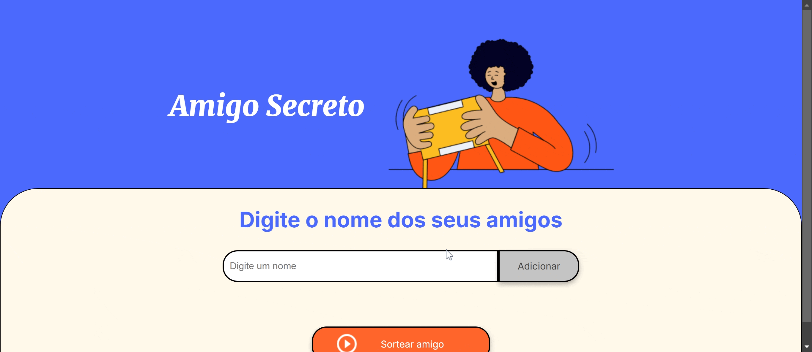

# Challenge Amigo Secreto

Este projeto foi desenvolvido utilizando HTML, CSS e JavaScript. Ele permite que o usuário adicione nomes a uma lista, e em seguida, sorteie aleatoriamente um nome da lista, simulando o processo de um Amigo Secreto.
## Funcionalidades

- **Adicionar amigos**: O usuário pode inserir nomes através de um campo de texto.
- **Visualizar lista de amigos**: Todos os nomes inseridos são exibidos em uma lista na tel
- **Sorteio de Amigo Secreto**: O sistema sorteia aleatoriamente um amigo da lista e exibe o resultado.

## Demonstração

## Como Contribuir

1. Faça um fork deste repositório.
2. Crie uma branch com a sua feature `git checkout -b minha-feature`.
3. Commit suas mudanças `git commit -am 'Adiciona nova funcionalidade'`.
4. Push para a branch `git push origin minha-feature`.
5. Abra um Pull Request.
